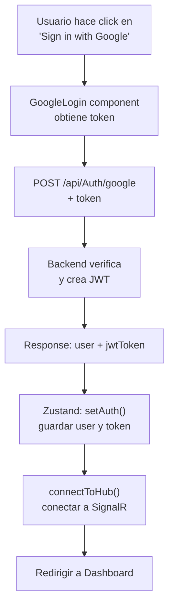
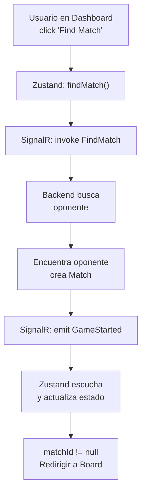
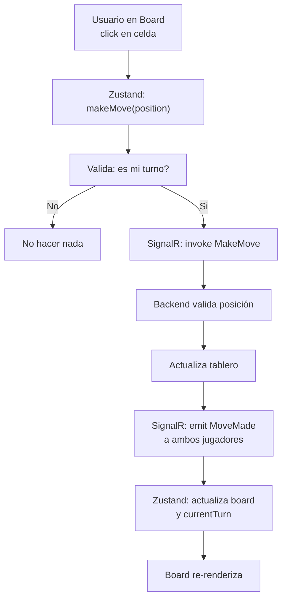
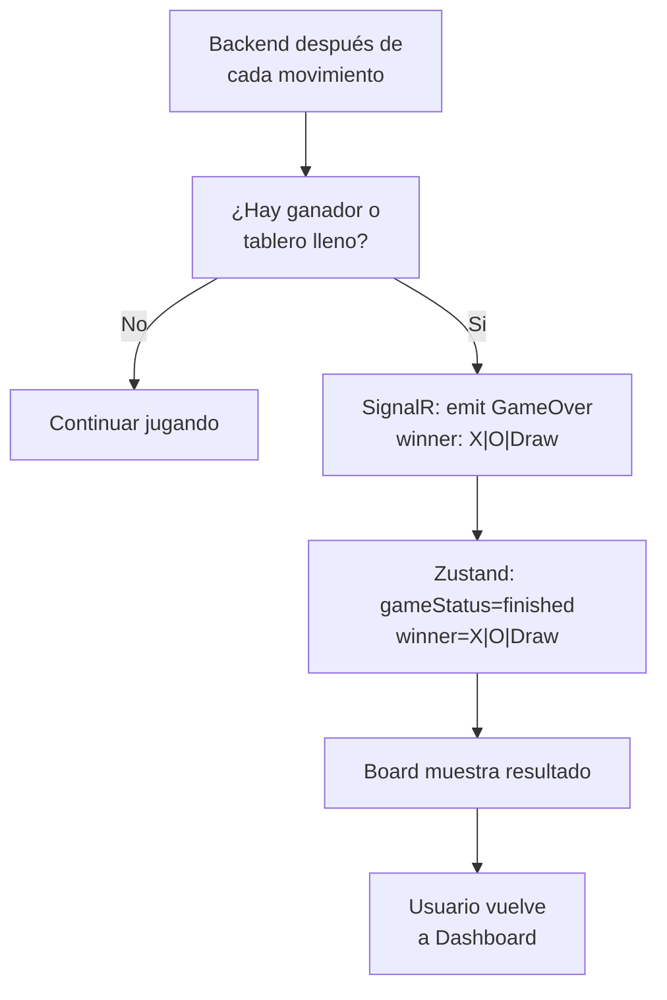

# 🏗️ Architecture Overview

Documentación técnica sobre la arquitectura del frontend, flujos de datos y patrones utilizados.

## 📐 Arquitectura General

```
┌─────────────────────────────────────────────────────────┐
│                    Browser / Frontend                    │
├─────────────────────────────────────────────────────────┤
│                                                           │
│  ┌──────────────┐      ┌──────────────┐                │
│  │   App.jsx    │      │ GoogleOAuth  │                │
│  └──────┬───────┘      └──────┬───────┘                │
│         │                     │                         │
│         └──────────┬──────────┘                         │
│                    │                                    │
│         ┌──────────▼──────────┐                        │
│         │                      │                        │
│         └─ Zustand Store ──────┘                        │
│            (useGameStore)                               │
│                │                                        │
│         ┌──────┴──────┬──────────┬────────┐            │
│         │             │          │        │            │
│      Login       Dashboard      Board    Axios         │
│     Component    Component    Component  Instance       │
│         │             │          │        │            │
└─────────┼─────────────┼──────────┼────────┼────────────┘
          │             │          │        │
          │ HTTP        │ HTTP     │SignalR │
          │ Requests    │ Requests │ Events │
          │             │          │        │
┌─────────▼─────────────▼──────────▼────────▼────────────┐
│                  Backend (.NET 8)                       │
├─────────────────────────────────────────────────────────┤
│                                                           │
│  POST /api/Auth/google (JWT Token)                      │
│  GET /api/Profile/stats (User Stats)                    │
│  SignalR Hub /gamehub (Real-time Game)                  │
│                                                           │
│  Database: User, Match, Stats                           │
│                                                           │
└─────────────────────────────────────────────────────────┘
```

## 🔄 Flujos de Datos

### 1. Flujo de Autenticación



### 2. Flujo de Partida



### 3. Flujo de Jugada



### 4. Flujo de Resultado



## 🏪 Zustand Store Structure

```javascript
{
  // ===== SESION =====
  user: {
    id: string,
    name: string,
    email: string,
    avatar?: string
  },
  token: string (JWT),

  // ===== JUEGO =====
  matchId: string,
  board: Array(9) [X|O|null],  // 0-8 = tablero plano
  currentTurn: X|O|null,
  playerSymbol: X|O|null,
  opponent: { id, name, avatar },
  gameStatus: waiting|playing|finished|null,
  winner: X|O|Draw|null,
  stats: { totalWins, totalLosses, totalDraws, winRate, matchHistory[] },

  // ===== SIGNALR =====
  hubConnection: HubConnection,
  isConnected: boolean,

  // ===== ACCIONES =====
  setAuth(user, token),
  logout(),
  connectToHub(),
  disconnectFromHub(),
  makeMove(position),
  findMatch(),
  setStats(stats)
}
```

## 🔌 Integración de Axios

### Interceptor de Request
```javascript
(config) => {
  // Inyectar JWT en Authorization header
  const token = useGameStore.getState().token;
  if (token) {
    config.headers.Authorization = `Bearer ${token}`;
  }
  return config;
}
```

### Interceptor de Response
```javascript
(error) => {
  // Si token expira (401), limpiar sesión
  if (error.response?.status === 401) {
    useGameStore.getState().logout();
  }
  return Promise.reject(error);
}
```

## 🎯 Patrones Utilizados

### 1. **Zustand** (Estado Global)
- Store centralizado para sessión y juego
- Acciones para mutar estado
- Selector syntax (`state => state.property`)

### 2. **Axios Interceptors** (HTTP)
- Inyección automática de JWT
- Manejo centralizado de errores
- Sin necesidad de pasar token manualmente

### 3. **SignalR Hub** (Real-time)
- Conexión automática después de login
- Listeners declarativos para eventos
- Error handling con `.catch()`

### 4. **Material-UI** (UI Components)
- Grid para tablero
- Paper para paneles
- Table para estadísticas
- Button, Typography, Container, etc.

### 5. **Google OAuth** (Auth)
- Wrapper GoogleOAuthProvider en main.jsx
- Hook useGoogleLogin para obtener token
- Delegate a backend para verificación

## 🔐 Flujo de Seguridad

```
1. Google Token (Frontend)
   ↓
2. POST /api/Auth/google (Frontend → Backend)
   ↓
3. Backend verifica con Google APIs
   ↓
4. Backend genera JWT (contiene user ID y claims)
   ↓
5. JWT almacenado en Zustand (memoria)
   ↓
6. Axios injecciona JWT en cada request
   ↓
7. Backend valida JWT en cada endpoint
   ↓
8. SignalR usa JWT para autenticar conexión
```

**Notas de seguridad:**
- ⚠️ JWT se almacena en memoria (no persiste en refresh)
- ✅ Axios injecciona automáticamente
- ✅ Backend debe usar HTTPS en producción
- ✅ CORS debe estar configurado correctamente

## 🎮 Tablero 3x3 (Estructura)

```
Mapeo de posiciones (0-8):
┌─────┬─────┬─────┐
│ 0   │ 1   │ 2   │
├─────┼─────┼─────┤
│ 3   │ 4   │ 5   │
├─────┼─────┼─────┤
│ 6   │ 7   │ 8   │
└─────┴─────┴─────┘

Tablero en Zustand:
board: [X, null, O, X, O, null, O, X, null]
       [0, 1,    2, 3, 4, 5,    6, 7, 8]
```

## 📊 Flujos de Renderizado

### App.jsx (Route Logic)
```javascript
if (!token) → <Login />
else if (!matchId) → <Dashboard />
else → <Board />
```

### Dashboard.jsx (Stats Loading)
```javascript
useEffect(() => {
  fetchStats from /api/Profile/stats
  setStats en Zustand
}, [])
```

### Board.jsx (Game State)
```javascript
Renderiza 9 botones en grid 3x3
onClick → makeMove(index)
currentTurn === playerSymbol ? enabled : disabled
```

## 🔗 Dependencias de Componentes

```
App.jsx
├── useGameStore (Zustand)
├── Login.jsx
│   ├── GoogleLogin (3p)
│   ├── useGameStore
│   └── api
├── Dashboard.jsx
│   ├── useGameStore
│   ├── api (GET /api/Profile/stats)
│   └── MUI Components
└── Board.jsx
    ├── useGameStore
    └── MUI Components
```

## 🚀 Performance Considerations

1. **Zustand Selectors**: Usan selector functions para evitar re-renders innecesarios
   ```javascript
   const token = useGameStore((state) => state.token)
   ```

2. **Axios Caching**: Axios no cachea por defecto, backend debe manejar
3. **SignalR Reconnection**: Automático en reconexiones
4. **MUI Typography**: Usa sx prop para estilos inline

## 🛠️ Debugging Tips

```javascript
// Ver estado completo de Zustand
console.log(useGameStore.getState());

// Ver conexión SignalR
const { hubConnection, isConnected } = useGameStore.getState();
console.log('Connected:', isConnected);

// Ver historico de eventos SignalR (devtools)
hubConnection.on('*', (methodName, ...args) => {
  console.log('Event:', methodName, args);
});
```

## 📋 Checklist de Integración Backend

- [ ] POST /api/Auth/google: Retorna `{ user, jwtToken }`
- [ ] GET /api/Profile/stats: Retorna estadísticas + historial
- [ ] SignalR Hub /gamehub: Acepta JWT en conexión
- [ ] Evento GameStarted: `{ matchId, currentTurn, yourSymbol, opponent }`
- [ ] Evento MoveMade: `{ position, symbol, nextTurn }`
- [ ] Evento GameOver: `{ winner }`
- [ ] Método FindMatch: Busca oponente disponible
- [ ] Método MakeMove: Valida y actualiza tablero
- [ ] CORS: Permite requests desde http://localhost:5173
- [ ] Error Handling: 400/401/403/500 responses

---

Esta arquitectura permite:
- ✅ Comunicación real-time (SignalR)
- ✅ Autenticación segura (Google OAuth + JWT)
- ✅ Estado global centralizado (Zustand)
- ✅ Código limpio y mantenible
- ✅ Fácil de escalar y testear
